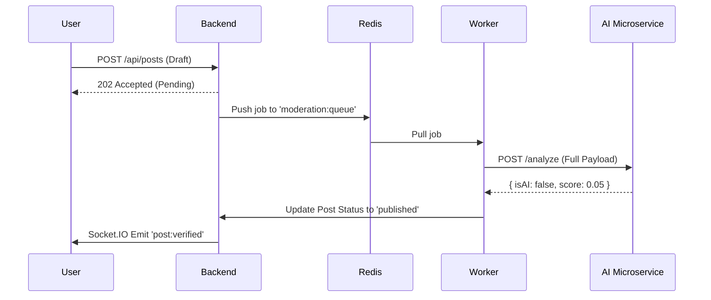

# 🏗️ HumanHub System Architecture

HumanHub is a hybrid social platform designed to combat AI misinformation by requiring "Proof of Humanity" for every post.

## 🗺️ High-Level Component Map

| Component | Responsibility | Tech Stack |
| :--- | :--- | :--- |
| **Edge Gateway** | Traffic routing, SSL, Rate Limiting | NGINX |
| **Frontend** | Reddit-style UI, State management, SSE/WS | React, Vite, Zustand |
| **App Server** | Business Logic, Orchestration, Auth | Node.js, Express |
| **AI Detection** | Deep learning pipeline (Text/Image) | Python, FastAPI |
| **Background Worker** | Async content verification queue | Redis + Node.js Worker |
| **Primary Data** | Persistent storage | MongoDB, PostgreSQL |

## 🔄 Content Verification Workflow (The "Pipeline")

## 🛠️ Infrastructure Requirements

1. **Docker Desktop:** Required for containerization.
2. **Node.js 18+:** Required for local development.
3. **Internal URLs:**
   - Backend: `http://localhost:5000`
   - Frontend: `http://localhost` (Nginx Redirect)
   - AI API: `http://localhost:8000`

## 🧱 Data Models (Mongoose)

### User
- `username`: Unique ID for interactions.
- `trustScore`: 0.0 (Bot Likely) to 1.0 (Human Verified).
- `role`: [user, moderator, admin].

### Post
- `status`: [pending, published, rejected].
- `detectionScores`: Detailed breakdowns of AI/Bot likelihood.
- `hotScore`: Algorithmic rank based on votes and time decay.

### Community
- `slug`: URL identifier (e.g., `/r/humanity`).
- `moderators`: List of human-verified users with veto power.
