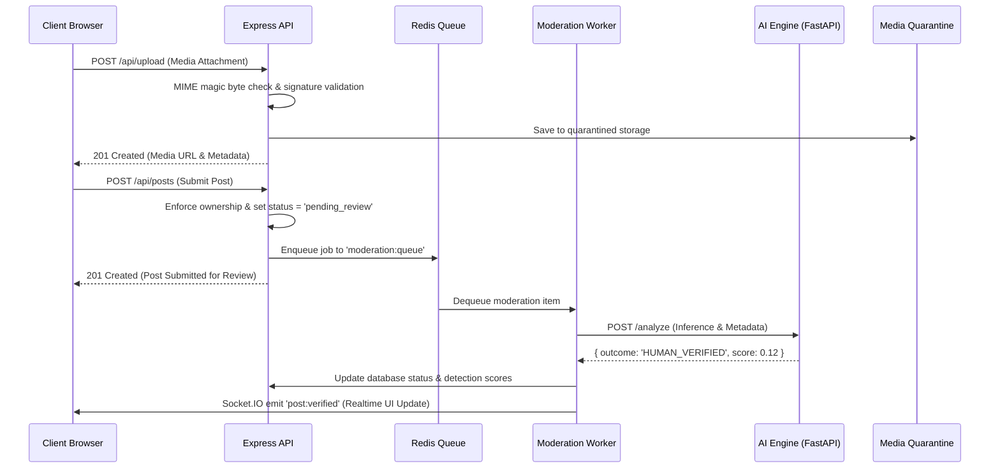

# HumanHub System Architecture

HumanHub is a full-stack social platform combining social media capabilities with fine-grained authorization, database-backed session security, Multi-Factor Authentication, and an image origin/provenance verification pipeline.

---

## 1. High-Level Component Map

| Component | Responsibility | Technology Stack |
| :--- | :--- | :--- |
| **Edge Gateway** | SSL termination, reverse proxying, rate limiting | Nginx 1.25 (Alpine) |
| **Frontend SPA** | Responsive social interface, in-memory auth state, realtime feeds | React 18, Vite 5, Tailwind CSS, Zustand |
| **Application Server**| REST API endpoints, business logic, authorization, session management | Node.js, Express.js |
| **Realtime Gateway** | Bidirectional event distribution (messages, post updates) | Socket.IO 4.7 |
| **AI Inference Engine**| Image origin detection (UniversalFakeDetect), C2PA validation, EXIF parsing | Python 3.9+, FastAPI |
| **Background Workers**| Asynchronous queue consumption, model analysis, moderation dispatch | Redis 7 + Node.js Workers |
| **Primary Database** | Persistent document storage for users, posts, media analysis, sessions | MongoDB 6.0 |

---

## 2. Content & Media Lifecycle Workflow

```mermaid
sequenceDiagram
    participant User as Client Browser
    participant API as Express API
    participant Redis as Redis Queue
    participant Worker as Moderation Worker
    participant AI as AI Engine (FastAPI)
    participant Storage as Media Quarantine

    User->>API: POST /api/upload (Media Attachment)
    API->>API: MIME magic byte check & signature validation
    API->>Storage: Save to quarantined storage
    API-->>User: 201 Created (Media URL & Metadata)
    
    User->>API: POST /api/posts (Submit Post)
    API->>API: Enforce ownership & set status = 'pending_review'
    API->>Redis: Enqueue job to 'moderation:queue'
    API-->>User: 201 Created (Post Submitted for Review)

    Redis->>Worker: Dequeue moderation item
    Worker->>AI: POST /analyze (Inference & Metadata)
    AI-->>Worker: { outcome: 'HUMAN_VERIFIED', score: 0.12 }
    Worker->>API: Update database status & detection scores
    Worker->>User: Socket.IO emit 'post:verified' (Realtime UI Update)
```

---

## 3. Data Models (Mongoose)

### User (`server/models/User.js`)
* `username`, `email`, `displayName`, `avatar`, `bio`
* `passwordHash`: Argon2id encoded string (`$argon2id$...`)
* `passwordVersion`: Incrementing counter for bulk token invalidation
* `role`: `user` | `moderator` | `admin`
* `mfa`: `{ enabled, secretEncrypted, backupCodes, lastUsedTimestep, passkeys }`
* `privacySettings`: `{ isPrivate, allowDirectMessages }`

### Session (`server/models/Session.js`)
* `user`: ObjectId reference to User
* `tokenHash`: SHA-256 hash of the 48-byte random refresh token
* `expiresAt`: TTL index for automatic cleanup (7 days)
* `revokedAt`: Timestamp of revocation (null if active)
* `userAgent`, `ipAddress`, `lastActive`: Device metadata for active session listing

### Post (`server/models/Post.js`)
* `caption`, `body`, `author`, `community`
* `mediaUrls`: Array of sanitized relative upload paths (`/api/uploads/...`)
* `mediaAnalysis`: References to `MediaAnalysis` documents
* `status`: `pending_review` | `published` | `blocked`
* `likesCount`, `savesCount`, `commentsCount`

### MediaAnalysis (`server/models/MediaAnalysis.js`)
* `mediaId`, `mediaUrl`, `storagePath`, `uploader`, `post`
* `analysisOutcome`: `PENDING` | `HUMAN_VERIFIED` | `AI_GENERATED` | `ANALYSIS_UNAVAILABLE`
* `c2pa`: Content Credentials status and manifest summary
* `metadata`: Sanitized EXIF/XMP data (GPS and serials stripped)
* `dispute`: Review requests and moderator notes

### Block (`server/models/Block.js`)
* `blocker`: User initiating the block
* `blocked`: User being blocked
* Unique compound index ensuring bidirectional blocking enforcement
