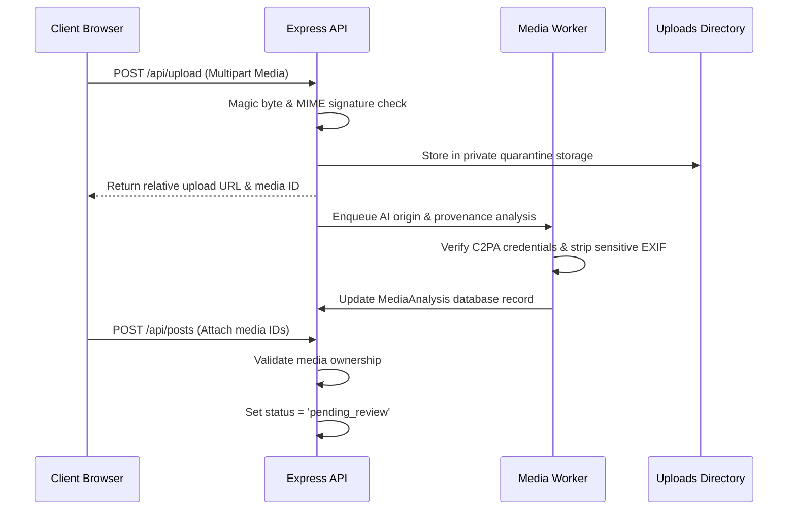

# Media Access Policy & Secure Delivery Pipeline

## 1. Overview
HumanHub protects user privacy by eliminating unauthenticated static media access (`express.static`) and enforcing fine-grained authorization checks prior to streaming any binary asset.

---

## 2. Media Lifecycle & Quarantine Flow

---

## 3. Authorization Matrix for Media Delivery (`/api/uploads/:filename`)

| Asset Type | Target Resource | Authorization Rule | Cache Policy |
| :--- | :--- | :--- | :--- |
| **Avatar** | User Profile | Publicly accessible to any client. | `public, max-age=86400` |
| **Public Post Media** | Published Post from Public Account | Accessible to anyone (anonymous or authenticated). | `public, max-age=3600` |
| **Private Post Media** | Post from Private Account | Accessible only to author, approved followers, or admins/moderators. | `private, no-cache` |
| **Pending Post Media** | Post awaiting review | Accessible only to author, admin, or moderator. | `private, no-cache` |
| **Blocked User Post** | Bidirectional block active | Denied access (403 Forbidden). | `no-store` |
| **Direct Message Media** | Conversation Attachment | Accessible only to conversation participants. | `private, no-cache` |
| **Quarantined / Unattached**| Fresh upload before post creation | Accessible only to uploader or admin/moderator. | `private, no-cache` |

---

## 4. Security Delivery Headers
All authorized media responses include defense-in-depth HTTP headers:
* `Content-Security-Policy: default-src 'none'` (Prevents browser from executing embedded SVGs or HTML)
* `X-Content-Type-Options: nosniff` (Prevents MIME type confusion attacks)
* `Cache-Control: private, no-cache` (For all restricted or private assets)
