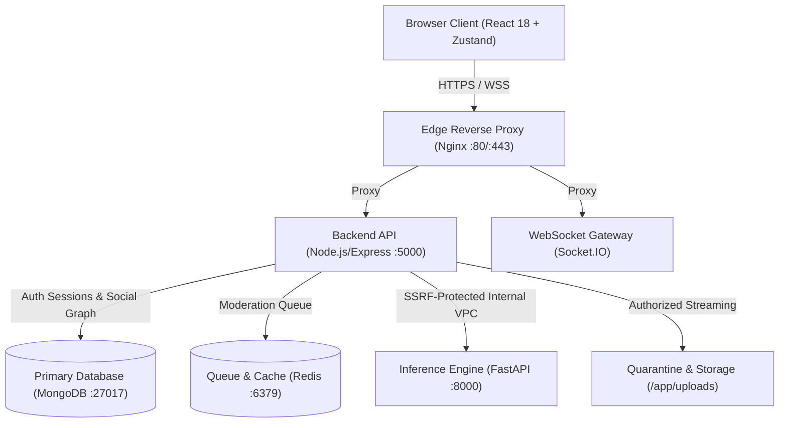

# HumanHub

HumanHub is a full-stack, Instagram-style social media platform engineered with fine-grained social privacy controls, database-backed session management, Multi-Factor Authentication (MFA), media access governance, and an image origin/provenance analysis pipeline.

The platform provides a responsive social interface for public and private user profiles, media posts, comments, likes, saves, follows, real-time direct messaging, notifications, and moderation workflows.

---

## Current Capabilities & Maturity Status

| Feature / Domain | Status | Technical Details & Verification |
| :--- | :--- | :--- |
| **Authentication & Password Security** | **Implemented** | Argon2id hashing (`m=65536, t=3, p=4`), zero-data-loss legacy bcrypt migration on login, length bounded (8–128 chars), rate-limited OTP verification. |
| **Session Management & Refresh Rotation** | **Implemented** | Database-backed sessions with 48-byte opaque refresh tokens stored as SHA-256 hashes, atomic single-use rotation, token-family replay detection, in-memory client bearer tokens, `HttpOnly` `SameSite=Lax` cookies. |
| **Multi-Factor Authentication (MFA)** | **Implemented** | RFC 6238 TOTP with AES-256-GCM encrypted secret storage, anti-replay timestep tracking, 10 single-use hashed backup recovery codes, `/mfa/verify-login` challenge routing. |
| **Social Privacy & Access Control (BOLA)** | **Implemented** | Centralized authorization policy engine (`server/policies/authorization.js`), private account gating, bidirectional user blocking across feeds, profiles, comments, and direct messages. |
| **Authorized Media Streaming** | **Implemented** | Direct static serving (`express.static`) replaced with authorized streaming (`/api/uploads/:filename`) enforcing post and media privacy permissions with strict CSP and nosniff headers. |
| **Real-time Messaging & Notifications** | **Implemented** | Authenticated Socket.IO rooms with server-derived channel identities, recipient privacy preference checks, conversation participant verification. |
| **Moderation Queue & Worker** | **Implemented** | New posts default to `pending_review`; asynchronous Redis queue processor; moderator dashboard with audit logs, ban actions, and manual review. |
| **Image Origin & C2PA Analysis** | **Implemented (Local / Staging)** | Modular Python FastAPI engine with C2PA Content Credentials extraction, metadata inspection (EXIF/XMP/IPTC), and UniversalFakeDetect detector bridge. Returns honest unavailable state when models are unconfigured. |
| **Container & Edge Hardening** | **Implemented** | Production Docker Compose (`docker-compose.prod.yml`) isolating database and AI services on internal networks with dropped Linux capabilities and `no-new-privileges:true`. |

---

## Technology Stack

| Layer | Technology | Purpose | Tested / Supported Version |
| :--- | :--- | :--- | :--- |
| **Frontend UI** | React 18 | Declarative component UI | `18.2.0` |
| **Build & Bundling** | Vite | Frontend development & production bundling | `5.4.21` |
| **Styling** | Tailwind CSS | Utility-first responsive design | `3.3.5` |
| **State Management** | Zustand | In-memory authentication, socket, and UI state | `4.4.0` |
| **HTTP Client** | Axios | REST API communication with interceptors | `1.6.0` |
| **Backend Runtime** | Node.js | Asynchronous JavaScript backend runtime | `v20.x` / `v24.x` |
| **Web Framework** | Express.js | REST API routing and middleware pipeline | `4.18.2` |
| **Database** | MongoDB | Document database for users, posts, sessions, media | `6.0` |
| **ODM** | Mongoose | Schema validation and database modeling | `8.0.2` |
| **Cache & Queues** | Redis | Job queues, pub/sub, rate-limiting store | `7.0` (Alpine) |
| **Real-Time** | Socket.IO | Bi-directional WebSocket event delivery | `4.7.2` |
| **AI / Provenance** | Python + FastAPI | Metadata analysis, C2PA validation, detector engine | `Python 3.9+` / `FastAPI 0.128` |
| **Reverse Proxy** | Nginx | Edge routing, TLS termination, static proxying | `1.25-alpine` |

---

## Architecture & Trust Boundaries



### Directory Structure

```text
HumanHub/
├── client/                     # React 18 + Vite Frontend
│   ├── src/
│   │   ├── components/         # Modals, Navigation, Media, Moderation
│   │   ├── pages/              # Feed, Profile, Messages, Settings, Moderation
│   │   ├── store/              # Zustand Stores (authStore, useSocketStore)
│   │   └── services/           # Axios API Client & Interceptors
│   ├── package.json
│   └── vite.config.js
├── server/                     # Node.js + Express Backend
│   ├── config/                 # Security, Database & Redis Connections
│   ├── controllers/            # Auth, Post, User, Message, Media Delivery
│   ├── middleware/             # Auth, RateLimiter, Error Handling, Upload
│   ├── models/                 # User, Post, Session, Block, MediaAnalysis
│   ├── policies/               # Centralized Authorization Policies (BOLA)
│   ├── routes/                 # Express REST Endpoints
│   ├── services/               # MFA (TOTP/WebAuthn), Session, Detection
│   ├── socket/                 # Authenticated Socket.IO Event Handlers
│   ├── tests/                  # Automated Test Suites (43 passing tests)
│   ├── utils/                  # Argon2id Hasher, SSRF Validator, Mailer
│   └── workers/                # Queue Workers (Moderation, Media Analysis)
├── ai_services/                # Python FastAPI Image Origin Engine
│   ├── detectors/              # UniversalFakeDetect & Model Adapters
│   ├── provenance/             # C2PA Manifest & Certificate Parsers
│   ├── metadata/               # EXIF, XMP, IPTC Parsers & Sanitizers
│   ├── main.py                 # FastAPI Application Entrypoint
│   └── requirements.txt        # PyTorch, Pillow, C2PA Dependencies
├── nginx/                      # Nginx Gateway Configuration
│   └── nginx.conf
├── docker-compose.yml          # Development Stack
├── docker-compose.prod.yml     # Hardened Production Compose
├── package.json                # Root Workspace Manifest
├── LICENSE                     # MIT License
└── README.md
```

---

## Prerequisites & Local Setup

### 1. Prerequisites
* **Node.js**: `v20.x` or later (`v24.x` supported)
* **npm**: `v9.x` or later
* **Docker & Docker Compose**: `v24+` (for containerized setup)
* **Python**: `v3.9+` (optional, for native AI service execution)

### 2. Quick Start with Docker (Recommended)

```bash
# 1. Clone the repository
git clone https://github.com/inderash18/HumanHub.git
cd HumanHub

# 2. Copy environment template
cp .env.example .env

# 3. Start the entire application stack
docker compose up --build
```
* **Frontend Application:** [http://localhost](http://localhost) (via Nginx proxy)
* **Backend API:** [http://localhost/api](http://localhost/api)
* **AI Analysis Service:** [http://localhost:8000](http://localhost:8000)

---

### 3. Native Local Development Setup

#### Install Dependencies
```bash
# Install root, client, and server dependencies
npm run install:all
```

#### Start Backing Services (MongoDB & Redis)
```bash
# Launch MongoDB and Redis via Docker
docker run -d --name humanhub-mongo -p 27017:27017 mongo:6
docker run -d --name humanhub-redis -p 6379:6379 redis:alpine
```

#### Run Backend Server (Terminal 1)
```bash
npm run dev:server
```

#### Run Frontend Client (Terminal 2)
```bash
npm run dev:client
```

#### Run AI Services (Terminal 3 - Optional)
```bash
cd ai_services
python -m venv venv
# Windows:
.\venv\Scripts\activate
# Linux/macOS:
source venv/bin/activate

pip install -r requirements.txt
uvicorn main:app --host 0.0.0.0 --port 8000 --reload
```

---

## Environment Configuration

| Variable | Purpose | Target Service | Status | Safe Default / Generation |
| :--- | :--- | :--- | :--- | :--- |
| `NODE_ENV` | Runtime environment mode | Backend | Required | `development` or `production` |
| `PORT` | Express server port | Backend | Required | `5000` |
| `MONGODB_URI` | MongoDB connection connection string | Backend | Required | `mongodb://mongo:27017/humanhub` |
| `REDIS_URL` | Redis connection URL | Backend | Required | `redis://redis:6379` |
| `JWT_SECRET` | 256-bit secret for signing access JWTs | Backend | Required | `openssl rand -hex 32` |
| `JWT_REFRESH_SECRET` | Secret for refresh token handling | Backend | Required | `openssl rand -hex 32` |
| `MFA_ENCRYPTION_KEY` | 256-bit AES-GCM key for TOTP secrets | Backend | Required | `openssl rand -hex 32` |
| `ARGON2_MEMORY_COST`| Memory allocation in KiB for Argon2id | Backend | Optional | `65536` (64 MiB) |
| `ARGON2_TIME_COST`  | Iteration count for Argon2id | Backend | Optional | `3` |
| `ARGON2_PARALLELISM`| Thread parallelism for Argon2id | Backend | Optional | `4` |
| `FRONTEND_URL`      | Trusted origin for CORS and cookies | Backend | Required | `http://localhost` |
| `AI_SERVICE_URL`    | Internal endpoint for AI inference | Backend | Optional | `http://ai_services:8000` |
| `VITE_API_URL`      | Base path for client Axios requests | Frontend | Required | `/api` |
| `VITE_SOCKET_URL`   | Base URL for Socket.IO connections | Frontend | Required | `/` |

---

## Available Scripts

| Command | Action |
| :--- | :--- |
| `npm run dev` | Starts the containerized development stack with live logs. |
| `npm run dev:client` | Launches Vite development server on port 3000. |
| `npm run dev:server` | Starts the Express server with `nodemon` auto-reload on port 5000. |
| `npm run dev:ai` | Starts the FastAPI AI service with `uvicorn` on port 8000. |
| `npm test` / `npm run test:server` | Executes the complete automated test suite (**43 tests**). |
| `npm run build` / `npm run build:client` | Compiles the production React application bundle via Vite. |
| `npm run lint` | Runs ESLint validation across frontend components. |
| `npm run seed` | Seeds default communities (`Technology`, `Science`, `Creativity`) into MongoDB. |
| `npm run db:clear` | *(Destructive)* Clears non-admin data for testing. |
| `npm run docker:up` | Builds and starts the local Docker stack in detached mode. |
| `npm run docker:prod`| Starts the hardened production container stack. |
| `npm run docker:down`| Stops and removes all running containers. |

---

## Main Product Workflows

1. **Authentication & Session Lifecycle**:
   - Registration requires email verification via a 6-digit cryptographically secure OTP.
   - Login issues a short-lived in-memory access token (15-min) and an `HttpOnly` `SameSite=Lax` refresh cookie.
   - If MFA is enabled, login requests a TOTP or single-use backup code challenge before issuing tokens.
   - Sessions rotate refresh tokens atomically upon renewal and can be remotely revoked from Settings.

2. **Post & Media Publishing**:
   - Media uploaded via `POST /api/upload` undergoes MIME signature and magic byte verification.
   - Uploads are saved into private quarantine.
   - Created posts default to `status: 'pending_review'` and enqueue for processing.
   - If AI detection is unavailable or model weights are missing, posts remain safely queued for moderator review.

3. **Social Privacy & Direct Messaging**:
   - Private accounts restrict post feeds and follower lists to approved followers.
   - Bidirectional user blocking prevents communication, profile viewing, and post interaction.
   - Direct messages require conversation membership and honor recipient privacy settings.

---

## Testing & Quality Assurance

HumanHub includes a comprehensive automated test suite covering all critical security, session, and social policies:

```bash
# Run the full backend test suite
npm test
```

### Test Coverage Summary (43/43 Tests Passing):
* **Password Hasher & Migration**: Argon2id OWASP compliance, zero-data-loss bcrypt verification, automatic rehash flag detection.
* **SSRF & Network Defenses**: DNS lookup resolution blocking private IPv4/IPv6, loopback, link-local, and cloud metadata (`169.254.169.254`).
* **MFA & Cryptography**: AES-256-GCM TOTP secret encryption, anti-replay timestep validation, single-use recovery code consumption.
* **Centralized Authorization (BOLA)**: Default-deny policies (`canViewPost`, `canEditPost`, `canDeletePost`, `canComment`, `canFollow`, `canMessage`).
* **Session Integrity & Socket Security**: Refresh family rotation, token replay invalidation, server-side room derivation.

---

## Production Deployment & Security

For production deployments, use the hardened production orchestration:

```bash
# 1. Create production environment configuration
cp .env.example .env.production
# Edit .env.production with production domains and 256-bit secrets

# 2. Start production stack
docker compose -f docker-compose.prod.yml --env-file .env.production up -d --build
```

### Key Production Controls:
* **Isolated Networks**: Databases (MongoDB, Redis) and AI services are on internal networks (`db_net`, `ai_net`) without host port exposure.
* **Least Privilege**: Dropped Linux capabilities (`cap_drop: - ALL`) and `no-new-privileges:true`.
* **Security Headers**: Production Content-Security-Policy (CSP), `frame-ancestors: 'none'`, and HSTS.

For detailed security documentation, refer to:
* [`SECURITY.md`](SECURITY.md) — Security baseline and vulnerability reporting SLA.
* [`THREAT_MODEL.md`](THREAT_MODEL.md) — STRIDE threat matrix and trust boundary analysis.
* [`SECURITY_FINDINGS.md`](SECURITY_FINDINGS.md) — Complete vulnerability register and remediation log.
* [`DEPLOYMENT_SECURITY.md`](DEPLOYMENT_SECURITY.md) — Production deployment and container hardening guide.
* [`INCIDENT_RESPONSE.md`](INCIDENT_RESPONSE.md) — Incident handling playbooks and rollback procedures.

---

## Troubleshooting

* **502 Bad Gateway on Login/API**: Ensure the backend container is running and MongoDB is healthy (`docker compose ps`).
* **Invalid Session or Immediate Logout**: Ensure `JWT_SECRET` is at least 32 characters and `FRONTEND_URL` matches the browser origin for cookie `SameSite` compliance.
* **Automatic Detection Unavailable**: Post status will remain in `pending_review` awaiting moderator approval at `/moderation`. Configure model weights in `ai_services/checkpoints` to enable automatic inference.
* **CORS Blocked**: Confirm `FRONTEND_URL` in `.env` exactly matches the URL in your browser address bar.

---

## Contributing & License

Contributions are welcome! Please create a feature branch and ensure all regression tests pass (`npm test`) before submitting a pull request.

This project is licensed under the [MIT License](LICENSE).
