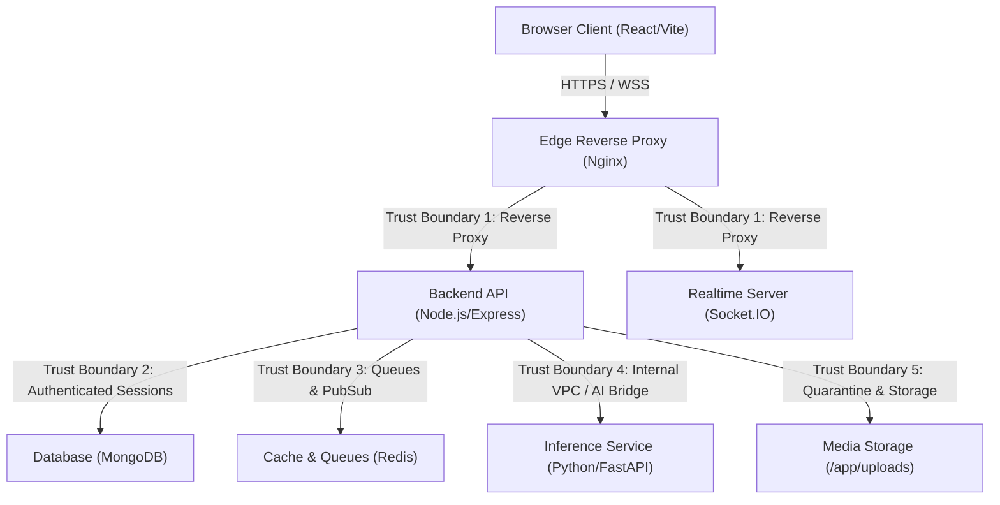

# Threat Model & STRIDE Analysis

## 1. System Architecture & Trust Boundaries

### Trust Boundaries:
1. **Trust Boundary 1 (Untrusted Client -> Edge Proxy):** All incoming HTTP/WebSocket traffic is untrusted. Mitigated by Nginx rate limiting, request size bounds, SSL/TLS termination, and security headers.
2. **Trust Boundary 2 (Express -> MongoDB):** Validated inputs with Mongoose ODM schemas. Rejection of operator objects (`$gt`, `$where`) and prototype pollution vectors.
3. **Trust Boundary 3 (Express -> Redis Queue):** Durable job queueing, bounded payload parsing, Redis isolation on internal bridge network (`db_net`).
4. **Trust Boundary 4 (Express -> AI Service / FastAPI):** Isolated internal network (`ai_net`). Strict SSRF validation preventing FastAPI from fetching arbitrary cloud metadata or local internal IP addresses.
5. **Trust Boundary 5 (Express -> Media Storage):** Authorized media streaming handler (`/api/uploads/:filename`) checking post/avatar/quarantine authorization before streaming bytes. Elimination of direct `express.static` file serving.

---

## 2. STRIDE Threat Matrix & Mitigations

| Threat Category | Specific Threat Vector | Impact | Mitigating Control | ASVS Requirement |
| :--- | :--- | :--- | :--- | :--- |
| **Spoofing** | Session token replay or forgery; Socket room spoofing | Account Takeover, unauthorized real-time listening | Cryptographic JWT signing with high-entropy keys; opaque 48-byte refresh tokens rotated atomically; server-side socket authentication deriving private room identity from session. | V3.2, V3.5, V13.1 |
| **Tampering** | Parameter manipulation, post status tampering, mass assignment | Unauthorized post publishing, privilege escalation | Strict Mongoose allowlists; server-enforced `status: 'pending_review'` default; author/admin verification. | V4.1, V5.1 |
| **Repudiation** | Moderator actions or password resets unrecorded | Inability to audit security incidents | Structured security event logging for authentication, MFA, moderation actions, and session revocations with user ID and timestamp tracking. | V10.1, V10.3 |
| **Information Disclosure** | Private post leak, unauthenticated static media access, user enumeration | Privacy violation, stalking, account harvesting | Centralized `canViewPost` policy; private account follower gating; secure media streaming endpoint; generic auth & password reset responses. | V2.1, V4.1, V13.3 |
| **Denial of Service** | Argon2id compute exhaustion, large payload uploads, regex DoS | Server crash, unresponsive UI | Strict rate limiters (`apiLimiter`, `authLimiter`); 50MB payload limits; password length max 128 chars; sanitized escaped regex queries. | V2.4, V11.1, V13.2 |
| **Elevation of Privilege** | BOLA / IDOR on post deletion, user blocking, direct messaging | Unauthorized deletion or harassment | Centralized authorization policies (`server/policies/authorization.js`); bidirectional block verification in all social interactions. | V4.1, V4.2, V4.3 |

---

## 3. Residual Risks & Operator Dependencies
* **External Provider Secrets:** Historical secrets previously exposed in Git commit `daaa1bc` must be rotated in external consoles (Cloudinary, SendGrid, SMTP).
* **TLS Certificate Management:** Production deployment requires operator installation of valid Let's Encrypt or corporate CA SSL certificates in `/etc/nginx/ssl`.
