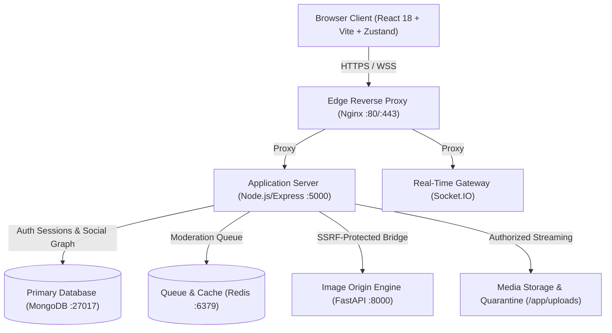
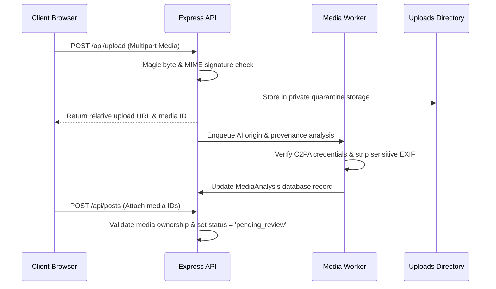

# HumanHub Architecture & System Design

HumanHub is a full-stack social media platform providing social graph capabilities with fine-grained authorization, database-backed session security, Multi-Factor Authentication (MFA), media access governance, and an image origin/provenance verification pipeline.

---

## 1. System Topology & Component Map

### Component Responsibilities
* **Edge Gateway (`nginx/`)**: Terminates TLS/SSL, enforces rate limiting, routes API traffic to Express, WebSocket upgrades to Socket.IO, and serves static frontend assets.
* **Frontend SPA (`client/`)**: Single-Page Application built with React 18, Vite, Tailwind CSS, and Zustand for in-memory authentication state.
* **Application Server (`server/`)**: Express.js REST API enforcing authentication, input validation, rate limiting, and centralized business policies.
* **Real-time Gateway (`server/socket/`)**: Manages authenticated WebSocket rooms for instant direct messaging and post-verification alerts.
* **Image Origin Engine (`ai_services/`)**: Python FastAPI service extracting C2PA Content Credentials, EXIF/XMP metadata, and executing UniversalFakeDetect inference.
* **Background Worker (`server/workers/`)**: Consumes moderation and media analysis jobs from Redis queues asynchronously.
* **Primary Database (`mongo`)**: Document store holding user accounts, database-backed sessions, posts, blocks, and analysis records.

---

## 2. Authentication, Session & MFA Architecture

### Password Protection & Argon2id Migration
* **Hashing Configuration:** Argon2id with OWASP Level 2 parameters (`memoryCost: 65536 KiB`, `timeCost: 3`, `parallelism: 4`, output length 32 bytes).
* **Zero-Data-Loss Migration:**
  1. User authenticates via `/api/auth/login`.
  2. If the stored password hash is legacy bcrypt (`$2...`), it is verified with `bcrypt.compare`.
  3. Upon valid authentication, the password is transparently re-hashed with Argon2id and updated in MongoDB.
  4. `user.passwordVersion` is incremented to invalidate stale tokens.
* **Password Limits:** 8 to 128 characters (permitting long passphrases and password-manager pasting).

### Session Lifecycle & Refresh Token Rotation
* **Access Tokens (JWT):** 15-minute lifespan, signed with explicit `HS256`, stored strictly in browser memory (Zustand store).
* **Refresh Tokens (Opaque CSPRNG):** 48-byte cryptographically secure random bytes (96 hex characters). Stored in MongoDB `Session` collection as SHA-256 hashes. Delivered via `HttpOnly`, `SameSite=Lax`, `Secure` cookies.
* **Atomic Rotation & Replay Detection:** Every call to `/api/auth/refresh` rotates the token atomically using `findOneAndUpdate`. If a previously used or revoked token is replayed, the entire session family is revoked immediately.
* **Active Session Management:** Users can inspect active sessions (`GET /api/auth/sessions`) with advisory device information, IP, and last activity, or revoke sessions remotely (`DELETE /api/auth/sessions/:id`, `POST /api/auth/sessions/revoke-others`).

### Multi-Factor Authentication (MFA)
* **TOTP Authenticator (RFC 6238):** Shared secrets are encrypted at rest using **AES-256-GCM** with a managed 256-bit key (`MFA_ENCRYPTION_KEY`).
* **Anti-Replay Defense:** Timestep recording (`mfa.lastUsedTimestep`) prevents reusing accepted TOTP codes within valid time windows.
* **Single-Use Backup Recovery Codes:** 10 cryptographically random backup recovery codes generated upon setup, stored as SHA-256 hashes, and consumed atomically.
* **MFA Login Challenge:** Two-step authentication flow returning `{ mfaRequired: true, challengeId }` before issuing tokens.

---

## 3. Centralized Authorization & BOLA Defenses

HumanHub implements a centralized policy engine in `server/policies/authorization.js`:

| Policy Function | Target Action | Enforced Access Control Matrix |
| :--- | :--- | :--- |
| `canViewPost` | View Post / Detail | Allowed if post is published public; restricted to author/approved followers/admins if author account is private; restricted to author/mods if status is `pending_review` or `blocked`. Denied if bidirectional block is active. |
| `canEditPost` | Update Post | Author only (must not be banned). |
| `canDeletePost`| Delete Post | Author or Admin/Moderator. |
| `canViewMedia` | Stream Media File | Public post media: public. Private post media: approved followers/author/mods. Quarantined/unattached: uploader or admin/moderator. |
| `canComment` | Add Comment | Allowed if user can view post and is not blocked. |
| `canFollow` | Follow Account | Allowed if target is not self and no bidirectional block is active. |
| `canMessage` | Send Direct Message | Allowed if recipient accepts DMs, conversation participant check passes, and neither user has blocked the other. |
| `canViewConversation`| View DM Thread | Verified conversation participants only. |
| `canModerate` | Moderator Actions | Admin or Moderator role required. |

---

## 4. Media Access Policy & Delivery Pipeline

### Media Streaming Endpoint (`/api/uploads/:filename`)
* **Strict Filename Validation:** RegEx check `/^[a-zA-Z0-9_\-\.]+$/` blocking path traversal (`../`, `\`).
* **Dynamic Authorization:** Validates whether the requested file belongs to an avatar (public), a public post, a private post (follower check), or an unattached upload (uploader check).
* **Security Headers:**
  - `Content-Security-Policy: default-src 'none'` (prevents script execution in SVG/HTML uploads).
  - `X-Content-Type-Options: nosniff` (mitigates MIME type confusion).
  - `Cache-Control: private, no-cache` (for restricted and private content).

---

## 5. Core Data Models (Mongoose)

* **User (`server/models/User.js`)**: Account credentials, Argon2id hash, `passwordVersion`, `role` (user/moderator/admin), `mfa` configuration, `privacySettings` (isPrivate, allowDirectMessages).
* **Session (`server/models/Session.js`)**: `user`, `tokenHash` (SHA-256), `expiresAt` (TTL index), `revokedAt`, `userAgent`, `ipAddress`, `lastActive`.
* **Post (`server/models/Post.js`)**: `caption`, `body`, `author`, `community`, `mediaUrls`, `mediaAnalysis`, `status` (`pending_review`, `published`, `blocked`), `likesCount`, `savesCount`.
* **MediaAnalysis (`server/models/MediaAnalysis.js`)**: `mediaId`, `mediaUrl`, `storagePath`, `uploader`, `analysisOutcome` (`PENDING`, `HUMAN_VERIFIED`, `AI_GENERATED`, `ANALYSIS_UNAVAILABLE`), `c2pa`, `metadata`, `dispute`.
* **Block (`server/models/Block.js`)**: `blocker`, `blocked` with compound unique index supporting bidirectional blocking queries.
* **Message (`server/models/Message.js`)** & **Conversation (`server/models/Conversation.js`)**: Direct messaging threads with participant verification and unread tracking.
