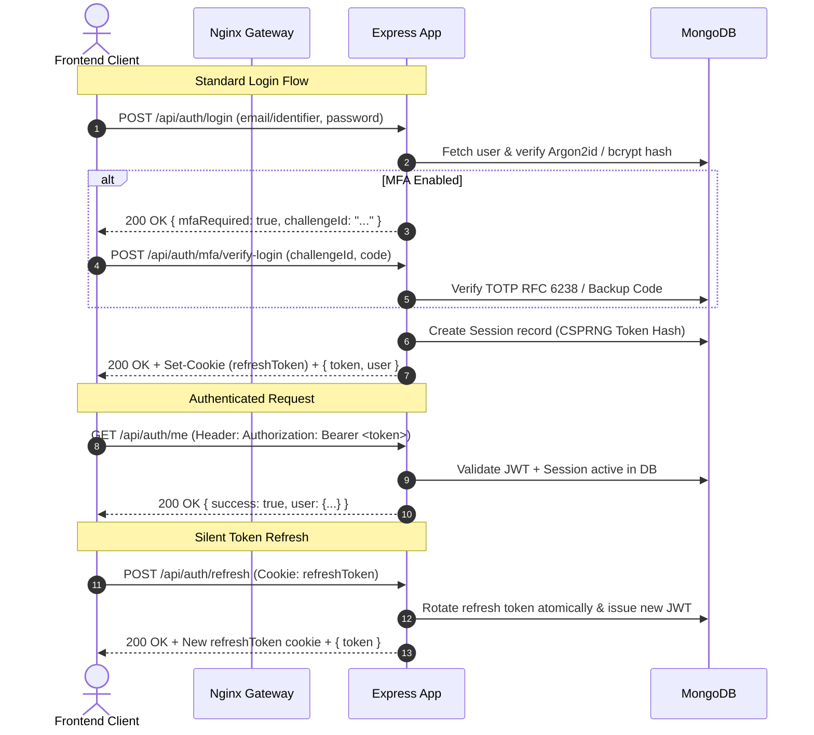

# HumanHub User Authentication Documentation & Code Reference

Complete technical specification and code examples for HumanHub's authentication, authorization, Multi-Factor Authentication (MFA), and session management architecture.

---

## 1. System Architecture & Flow



---

## 2. API Endpoints Specification

### Base Path
```
/api/auth
```

All public endpoints are rate-limited via `authLimiter` and origin-validated via `requireTrustedOrigin`.

---

### `POST /api/auth/register`
Creates a new user account and provisions an initial active session.

#### Request Headers
```http
Content-Type: application/json
```

#### Request Body
```json
{
  "username": "janedoe",
  "displayName": "Jane Doe",
  "email": "jane@example.com",
  "password": "SuperSecretPassword123!"
}
```

#### Response (`201 Created`)
```json
{
  "success": true,
  "token": "eyJhbGciOiJIUzI1NiIsInR5cCI6IkpXVCJ9...",
  "user": {
    "_id": "660c1d2e3f4a5b6c7d8e9f01",
    "username": "janedoe",
    "displayName": "Jane Doe",
    "email": "jane@example.com",
    "avatar": "https://api.dicebear.com/7.x/identicon/svg?seed=janedoe",
    "bio": "",
    "role": "user",
    "followersCount": 0,
    "followingCount": 0,
    "postsCount": 0
  }
}
```

---

### `POST /api/auth/login`
Authenticates user credentials. Rehashes legacy passwords to Argon2id transparently upon successful login.

#### Request Body
```json
{
  "identifier": "janedoe",
  "password": "SuperSecretPassword123!"
}
```

#### Response A: Standard Login Success (`200 OK`)
Sets `HttpOnly`, `SameSite=Lax`, `Secure` cookie `refreshToken`.
```json
{
  "success": true,
  "token": "eyJhbGciOiJIUzI1NiIsInR5cCI6IkpXVCJ9...",
  "user": {
    "_id": "660c1d2e3f4a5b6c7d8e9f01",
    "username": "janedoe",
    "displayName": "Jane Doe",
    "email": "jane@example.com",
    "role": "user"
  }
}
```

#### Response B: MFA Verification Required (`200 OK`)
```json
{
  "success": true,
  "mfaRequired": true,
  "challengeId": "a9e8f7d6c5b4a321..."
}
```

---

### `POST /api/auth/mfa/verify-login`
Completes 2-step verification using a standard 6-digit TOTP code or an 8-character single-use backup recovery code.

#### Request Body
```json
{
  "challengeId": "a9e8f7d6c5b4a321...",
  "code": "123456",
  "isBackupCode": false
}
```

#### Response (`200 OK`)
```json
{
  "success": true,
  "token": "eyJhbGciOiJIUzI1NiIsInR5cCI6IkpXVCJ9...",
  "user": {
    "_id": "660c1d2e3f4a5b6c7d8e9f01",
    "username": "janedoe",
    "email": "jane@example.com"
  }
}
```

---

### `POST /api/auth/refresh`
Performs atomic refresh token rotation. Replay attacks on old tokens revoke all sessions in the family.

#### Request
- **Headers:** `Cookie: refreshToken=<opaque_token>`

#### Response (`200 OK`)
```json
{
  "success": true,
  "token": "eyJhbGciOiJIUzI1NiIsInR5cCI6IkpXVCJ9..."
}
```

---

### `GET /api/auth/me`
Fetches the current authenticated user's profile and preferences.

#### Request Headers
```http
Authorization: Bearer <jwt_access_token>
```

#### Response (`200 OK`)
```json
{
  "success": true,
  "user": {
    "_id": "660c1d2e3f4a5b6c7d8e9f01",
    "username": "janedoe",
    "displayName": "Jane Doe",
    "email": "jane@example.com",
    "role": "user",
    "isMfaEnabled": true,
    "privacySettings": {
      "profileVisibility": "public",
      "allowDirectMessages": "everyone"
    }
  }
}
```

---

### `POST /api/auth/logout`
Revokes the current session from the database and clears the refresh token cookie.

#### Response (`200 OK`)
```json
{
  "success": true,
  "message": "Logged out successfully."
}
```

---

### `GET /api/auth/sessions`
Lists all active sessions across devices for the logged-in user.

#### Response (`200 OK`)
```json
{
  "success": true,
  "sessions": [
    {
      "id": "660c1e4f...",
      "userAgent": "Mozilla/5.0 (Windows NT 10.0; Win64; x64)...",
      "ipAddress": "192.168.1.100",
      "lastActive": "2026-10-06T22:20:00.000Z",
      "current": true
    },
    {
      "id": "660c2a1b...",
      "userAgent": "HumanHub Mobile/1.0 (iOS 17.4)",
      "ipAddress": "203.0.113.45",
      "lastActive": "2026-10-05T18:12:00.000Z",
      "current": false
    }
  ]
}
```

---

## 3. Client Integration Code Examples

### A. JavaScript / Fetch Integration
```javascript
// Example: Complete login handling with MFA fallback
async function loginUser(identifier, password) {
  const res = await fetch('/api/auth/login', {
    method: 'POST',
    headers: { 'Content-Type': 'application/json' },
    credentials: 'include', // Ensures refreshToken cookie is stored
    body: JSON.stringify({ identifier, password })
  });

  const data = await res.json();
  if (!res.ok) throw new Error(data.message || 'Login failed');

  if (data.mfaRequired) {
    // Prompt user for 6-digit TOTP code
    return { mfaRequired: true, challengeId: data.challengeId };
  }

  // Store access token in memory or state
  sessionStorage.setItem('token', data.token);
  return { success: true, user: data.user, token: data.token };
}
```

---

### B. Axios Protected Request Interceptor
```javascript
import axios from 'axios';

const api = axios.create({
  baseURL: '/api',
  withCredentials: true
});

api.interceptors.request.use((config) => {
  const token = sessionStorage.getItem('token');
  if (token) {
    config.headers.Authorization = `Bearer ${token}`;
  }
  return config;
});

api.interceptors.response.use(
  (response) => response,
  async (error) => {
    const originalRequest = error.config;
    if (error.response?.status === 401 && !originalRequest._retry) {
      originalRequest._retry = true;
      try {
        const { data } = await axios.post('/api/auth/refresh', {}, { withCredentials: true });
        sessionStorage.setItem('token', data.token);
        originalRequest.headers.Authorization = `Bearer ${data.token}`;
        return api(originalRequest);
      } catch (refreshError) {
        sessionStorage.removeItem('token');
        window.location.href = '/login';
        return Promise.reject(refreshError);
      }
    }
    return Promise.reject(error);
  }
);

export default api;
```

---

### C. React Hook (Zustand Auth Store)
```javascript
import { useAuthStore } from '../store/authStore';

export function UserProfileHeader() {
  const { user, isAuthenticated, logout } = useAuthStore();

  if (!isAuthenticated) {
    return <a href="/login" className="btn-primary">Sign In</a>;
  }

  return (
    <div className="flex items-center gap-3">
      
      <div>
        <h4 className="font-semibold">{user.displayName || user.username}</h4>
        <p className="text-xs text-neutral-400">@{user.username}</p>
      </div>
      <button onClick={logout} className="btn-ghost text-red-500">Log Out</button>
    </div>
  );
}
```

---

## 4. Key Source Code Files in HumanHub

| Component | Path | Description |
|---|---|---|
| **Auth Routes** | [`server/routes/auth.js`](file:///s:/HumanHub/server/routes/auth.js) | Express endpoints, route-level rate limits, and origin validation. |
| **Auth Controller** | [`server/controllers/authController.js`](file:///s:/HumanHub/server/controllers/authController.js) | Argon2id verification, TOTP MFA challenge/response, session cleanup. |
| **Auth Middleware** | [`server/middleware/auth.js`](file:///s:/HumanHub/server/middleware/auth.js) | `protect` & `optionalProtect` JWT/session decoders. |
| **Session Service** | [`server/services/sessionService.js`](file:///s:/HumanHub/server/services/sessionService.js) | Refresh cookie rotation, CSPRNG hashing, JWT creation. |
| **Zustand Client Store** | [`client/src/store/authStore.js`](file:///s:/HumanHub/client/src/store/authStore.js) | In-memory token management, MFA challenges, reactive hooks. |
| **Security Configuration** | [`server/config/security.js`](file:///s:/HumanHub/server/config/security.js) | CSRF origin checks, JWT secrets, cookie parameters. |
