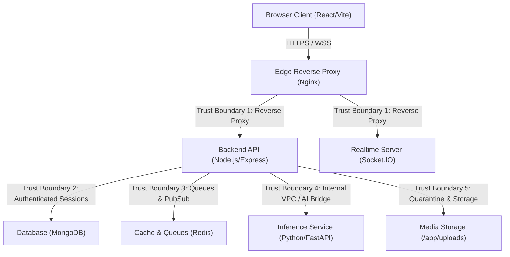

# HumanHub Security Dossier & Verification

## 1. OWASP ASVS Baseline & Implemented Controls

HumanHub adheres to the **OWASP Application Security Verification Standard (ASVS) v4.0.3 Level 2** baseline:

* **V2 Authentication & Password Security:** Argon2id hashing (`m=65536, t=3, p=4`), zero-data-loss legacy bcrypt migration, password length bounds (8–128 chars), rate limiting, timing-safe OTP verification.
* **V3 Session Management:** Database-backed `Session` collection, opaque cryptographically secure 48-byte refresh tokens stored as SHA-256 hashes, atomic single-use refresh token rotation, in-memory frontend bearer tokens, HttpOnly `SameSite=Lax` Secure refresh cookies, immediate session revocation upon logout, password reset, or ban.
* **V4 Access Control (BOLA/IDOR Prevention):** Centralized authorization policy engine (`server/policies/authorization.js`), default-deny access matrices for posts, profiles, media, comments, and direct messages.
* **V5 Validation, Sanitization & Encoding:** Allowlist schema validation, regex escaping on search queries, NoSQL operator injection prevention, dangerous object key rejection.
* **V8 Data Protection & Cryptography:** AES-256-GCM authenticated encryption for TOTP shared secrets with versioned keys, high-entropy CSPRNG tokens, secure password hashing.
* **V12 SSRF Protection:** DNS resolution validation, blocking IPv4/IPv6 private ranges, loopback (`127.0.0.0/8`, `::1`), link-local (`169.254.0.0/16`, `fe80::/10`), unique local (`fc00::/7`), and cloud metadata endpoints (`169.254.169.254`).
* **V13 API & Web Service Security:** Strict CORS allowlists, anti-CSRF protections, request size bounding (`50mb` max), security headers (CSP, HSTS, frame-ancestors 'none', nosniff, strict referrer).
* **V14 Configuration & Container Security:** Minimal Docker base images, dropped Linux capabilities (`cap_drop: ALL`), non-root execution, `no-new-privileges:true`, network isolation for databases and AI workers.

---

## 2. Threat Model & STRIDE Analysis



### STRIDE Threat Matrix & Mitigations

| Threat Category | Specific Threat Vector | Impact | Mitigating Control | ASVS |
| :--- | :--- | :--- | :--- | :--- |
| **Spoofing** | Session token replay; Socket room spoofing | Account Takeover, unauthorized listening | Cryptographic JWT signing; opaque 48-byte refresh tokens rotated atomically; server-side socket authentication. | V3.2, V3.5, V13.1 |
| **Tampering** | Parameter manipulation, post status tampering | Unauthorized post publishing | Strict Mongoose allowlists; server-enforced `status: 'pending_review'` default; author/admin verification. | V4.1, V5.1 |
| **Repudiation**| Moderator actions or password resets unrecorded | Inability to audit security incidents | Structured security event logging with user ID and timestamp tracking. | V10.1, V10.3 |
| **Information Disclosure** | Private post leak, static media access, user enumeration | Privacy violation, account harvesting | Centralized `canViewPost` policy; private account follower gating; secure media streaming endpoint; generic auth responses. | V2.1, V4.1, V13.3 |
| **Denial of Service** | Argon2id compute exhaustion, payload flood, regex DoS | Server crash, unresponsive UI | Strict rate limiters (`apiLimiter`, `authLimiter`); 50MB payload limits; password length max 128 chars; sanitized escaped regex queries. | V2.4, V11.1, V13.2 |
| **Elevation of Privilege** | BOLA / IDOR on post deletion, user blocking, messaging | Unauthorized deletion or harassment | Centralized authorization policies (`server/policies/authorization.js`); bidirectional block verification. | V4.1, V4.2, V4.3 |

---

## 3. Findings Register & Remediation Audit

| ID | Title | Severity | Affected Component | Exploit Conditions | Status | Resolution |
| :--- | :--- | :--- | :--- | :--- | :--- | :--- |
| **SEC-01** | Unrestricted Static Uploads | **HIGH** | `server/app.js` | Direct file request to `/api/uploads/<file>` without auth. | **RESOLVED** | Replaced `express.static` with authorized streaming handler checking post & media privacy permissions. |
| **SEC-02** | Private Profile Post Leak | **HIGH** | `server/controllers/userController.js` | Direct query to `/api/users/profile/:id` on private account. | **RESOLVED** | Applied `canViewPost` policy; return empty post array unless requester is approved follower, owner, or admin. |
| **SEC-03** | Client-Supplied Remote Media URLs | **MEDIUM** | `server/controllers/postController.js` | Supplying external or `javascript:` URLs in `mediaUrls`. | **RESOLVED** | Enforced strict relative uploaded path allowlist (`/api/uploads/`, `/uploads/`) and ownership validation. |
| **SEC-04** | Inadequate Password Hashing | **HIGH** | `server/controllers/authController.js` | Legacy bcrypt hashing susceptible to GPU cracking; 72-byte truncation. | **RESOLVED** | Migrated to Argon2id (`m=65536, t=3, p=4`) with zero-data-loss legacy bcrypt verification and auto-rehash. |
| **SEC-05** | Lack of Multi-Factor Authentication | **HIGH** | `server/controllers/authController.js` | Credential stuffing leading to immediate account takeover. | **RESOLVED** | Implemented TOTP with AES-256-GCM encrypted secret storage, anti-replay timestep tracking, and single-use recovery codes. |
| **SEC-06** | Bearer Token Storage Exfiltration | **MEDIUM** | `client/src/store/authStore.js` | XSS vulnerability reading token from `localStorage`. | **RESOLVED** | Moved access token to in-memory Zustand store; refresh token stored in HttpOnly, `SameSite=Lax`, Secure cookie. |
| **SEC-07** | Server-Side Request Forgery (SSRF) | **HIGH** | `ai_services`, `server/routes/mediaAnalysis.js` | Malicious URLs targeting internal cloud metadata (`169.254.169.254`). | **RESOLVED** | Implemented `ssrfValidator.js` with DNS resolution checking, blocking IPv4/IPv6 private, loopback, and link-local ranges. |
| **SEC-08** | BOLA in Direct Messaging & Social Actions | **HIGH** | `server/controllers/messageController.js` | Messaging or querying conversations of blocked or private users. | **RESOLVED** | Centralized authorization policies (`server/policies/authorization.js`); bidirectional block verification. |
| **SEC-09** | Missing Security Headers & CSP | **MEDIUM** | `server/app.js` | Clickjacking, cross-site script inclusion, MIME sniffing. | **RESOLVED** | Configured Helmet with Content-Security-Policy (CSP), `frame-ancestors: 'none'`, and `X-Content-Type-Options: nosniff`. |
| **SEC-10** | Tracked Git Index Node Modules | **LOW** | Repository Git Index | Tracked `node_modules` bloating repository. | **RESOLVED** | Cached files removed from Git tracking index; `.gitignore` hardened. |

### Outstanding Historical Operator Action
* **External Credential Rotation:** Secrets previously exposed in historical commit `daaa1bc` must be rotated in external consoles (Cloudinary, SendGrid, SMTP). Removing files from Git history does not rotate keys on third-party servers.

---

## 4. Dated Verification & Test Results (September 2026)

All 43 automated tests execute and pass cleanly via Node.js native test runner (`npm test`):

* **Password Hasher & Migration Suite (`tests/securityHardening.test.js`)**:
  - Argon2id OWASP parameter hashing: **PASSED**
  - Seamless legacy bcrypt verification & auto-rehash flag: **PASSED**
  - Invalid password rejection across algorithms: **PASSED**
* **SSRF & Network Defense Suite (`tests/securityHardening.test.js`)**:
  - Private IPv4 ranges (`10.0.0.0/8`, `172.16.0.0/12`, `192.168.0.0/16`) blocked: **PASSED**
  - Loopback (`127.0.0.1`, `0.0.0.0`, `::1`) blocked: **PASSED**
  - Cloud metadata (`169.254.169.254`) and link-local blocked: **PASSED**
  - Non-HTTP protocols (`file://`, `gopher://`) blocked: **PASSED**
* **MFA & Cryptography Suite (`tests/securityHardening.test.js`)**:
  - AES-256-GCM secret encryption and authenticated decryption: **PASSED**
  - Single-use hashed backup recovery code generation & consumption: **PASSED**
  - Replay rejection for used recovery codes: **PASSED**
* **Centralized Authorization Suite (`tests/securityHardening.test.js`)**:
  - `canViewPost` public access & private account gating: **PASSED**
  - `canViewPost` bidirectional block enforcement: **PASSED**
  - `canDeletePost` owner and admin access verification: **PASSED**
  - `canFollow` & `canMessage` privacy settings enforcement: **PASSED**
* **Core Social & Session Regression Suite (`tests/security.test.js`)**:
  - Registration collision rejection: **PASSED**
  - Atomic OTP single-use consumption & attempt limiting: **PASSED**
  - Atomic refresh token rotation & token family replay detection: **PASSED**
  - Session revocation on logout, ban, or password reset: **PASSED**
  - Server-side Socket.IO room authorization: **PASSED**
  - MIME signature & magic byte upload validation: **PASSED**

---

## 5. Incident Response & Playbooks

### Playbook A: User Account Compromise / Token Theft
1. **Revoke All Active Sessions:**
   ```bash
   mongosh --eval 'db.sessions.updateMany({ user: ObjectId("<USER_ID>") }, { $set: { revokedAt: new Date() } })'
   ```
2. **Force Password Reset:** Increment `user.passwordVersion` by 1 to invalidate all existing tokens.
3. **Notify User:** Dispatch security notification email.

### Playbook B: Compromise of JWT Signing Secret
1. **Immediate JWT Secret Rotation:** Generate a new 256-bit secret (`openssl rand -hex 32`), update `JWT_SECRET` in `.env.production`, and perform a zero-downtime rolling restart of `backend`.
2. **Impact:** All active bearer tokens become instantly invalid; legitimate users transparently refresh or sign in again.

### Playbook C: Unauthorized Private Media Access
1. **Quarantine or Invalidate Media:** Mark the database record as `status: 'blocked'` or remove the file from `/app/uploads`.
2. **Purge Cache:** Issue an immediate CDN cache purge for the affected media path.

### Playbook D: Database Snapshot Restoration
1. **Stop Application Services:**
   ```bash
   docker compose -f docker-compose.prod.yml stop backend frontend
   ```
2. **Restore MongoDB Volume:**
   ```bash
   mongorestore --drop --gzip --archive=/backups/humanhub-snapshot-<TIMESTAMP>.gz
   ```
3. **Restart Stack & Verify Health:**
   ```bash
   docker compose -f docker-compose.prod.yml start
   ```
